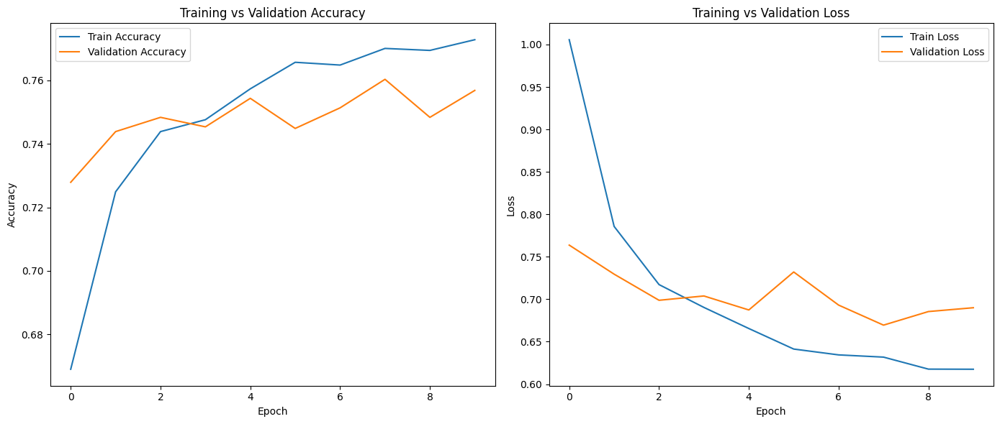
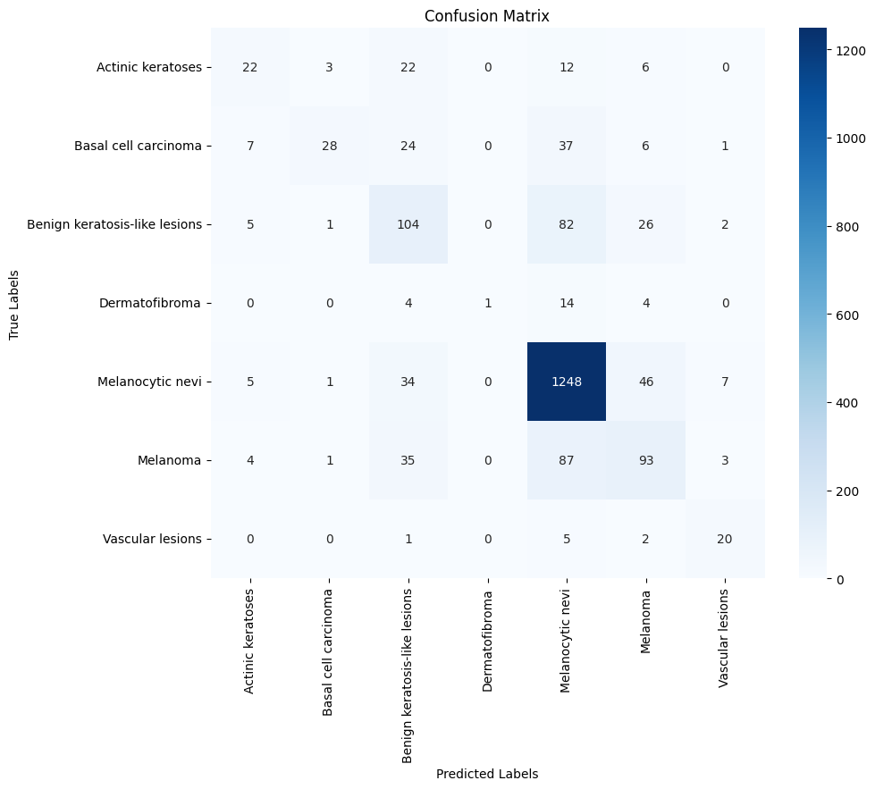
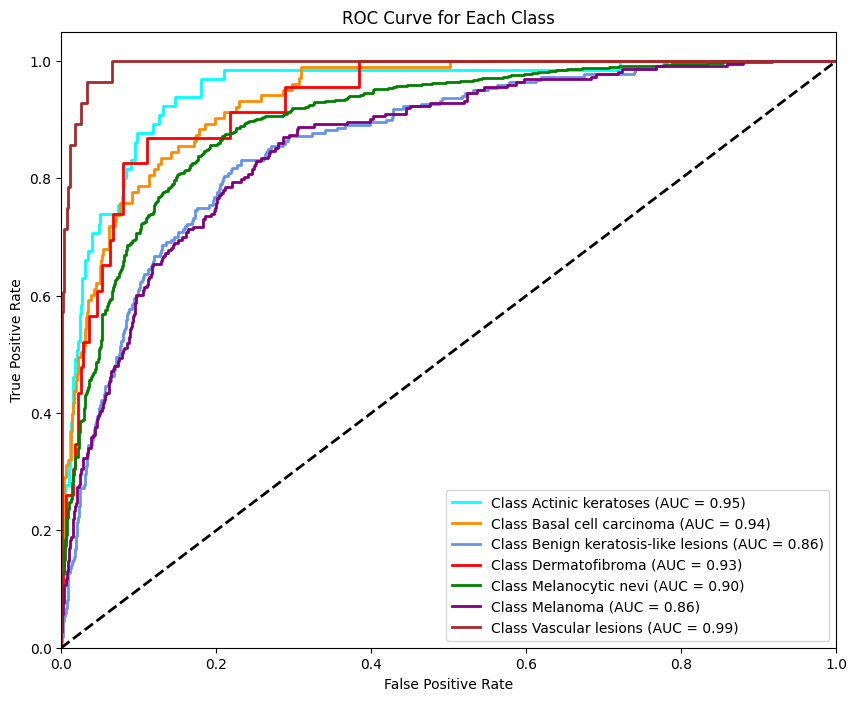

# 🔬 Skin Cancer Classification with Transfer Learning

This project focuses on classifying skin lesions using a CNN model with Transfer Learning (MobileNetV2) applied to the HAM10000 dataset. The goal is to predict whether a skin lesion image is benign or malignant by classifying it into one of seven diagnostic categories.

---

## 📌 Goals

- Build an efficient image classification model using Transfer Learning (MobileNetV2).
- Accurately categorize dermatoscopic images into 7 diagnostic skin lesion classes.
- Assess the model's performance using precision, recall, F1-score, and overall accuracy.
- Visualize training process and evaluation using plots (accuracy/loss), confusion matrix, and ROC curves.

## 📁 Dataset

The [HAM10000 dataset](https://www.kaggle.com/datasets/kmader/skin-cancer-mnist-ham10000) contains 10,015 dermatoscopic images labeled across the following 7 classes:

- akiec – Actinic keratoses  
- bcc – Basal cell carcinoma  
- bkl – Benign keratosis-like lesions  
- df – Dermatofibroma  
- nv – Melanocytic nevi  
- mel – Melanoma  
- vasc – Vascular lesions  

Each image is associated with metadata such as diagnosis, localization, and patient information.  
For this project, only images and diagnosis labels were used.  
The dataset was split into 80% training and 20% testing sets.

---

## 🧠 Model Architecture & Training

- Base Model: MobileNetV2 (pretrained on ImageNet, frozen during training)  
- Input Image Size: 224×224×3  
- Added Layers: GlobalAveragePooling → Dropout → Dense (softmax)  
- Loss Function: Categorical Crossentropy  
- Optimizer: Adam  
- Epochs: 10  
- Batch Size: 32  
- Augmentation: ImageDataGenerator with rotation, zoom, shift, and flip  

---

## 📊 Evaluation Results

### 📈 Accuracy vs Loss  

### 🔍 Confusion Matrix  

### 📈 ROC Curve (AUC per class)  

### 📝 Classification Report (Summary)

| Class                    | Precision | Recall | F1-score |
|--------------------------|-----------|--------|----------|
| Actinic keratoses        | 0.51      | 0.34   | 0.41     |
| Basal cell carcinoma     | 0.82      | 0.27   | 0.41     |
| Benign keratosis         | 0.46      | 0.47   | 0.47     |
| Dermatofibroma           | 1.00      | 0.04   | 0.08     |
| Melanocytic nevi         | 0.84      | 0.93   | 0.88     |
| Melanoma                 | 0.51      | 0.42   | 0.46     |
| Vascular lesions         | 0.61      | 0.71   | 0.66     |
| Overall Accuracy     | -         | -      | 0.76 |

> 🟡 Most classes performed well, especially "Melanocytic nevi". Some minority classes (e.g., Dermatofibroma) had low recall due to class imbalance.

---

## 🔗 Additional Resources

📘 You can run this project interactively and explore the training outputs on Kaggle:  
👉 [View Full Notebook on Kaggle](https://www.kaggle.com/code/foroughgh95/skin-cancer-classification-mobilenetv2-ham1000)

---

## ⚖️ License  
This project is licensed under the MIT License. See the [LICENSE](../LICENSE) file for details.

---

## 👩‍💻 Author  
Developed by Forough Ghayyem  
📫 [GitHub](https://github.com/foroughm423) | [LinkedIn](https://www.linkedin.com/in/forough-ghayyem/)
